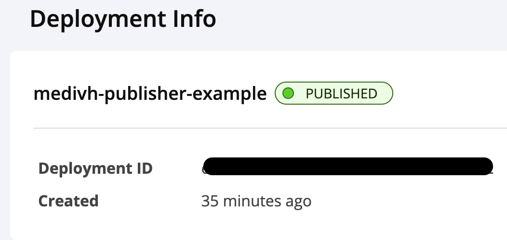

= Medivh-Publish

++++

  <h2 align="center"></h2> 

++++

Languages: link:./doc/README_zh.adoc[中文文档] | English

> Medivh-publisher is a Gradle plugin designed to publish Gradle projects to the Maven Central Repository.
This plugin allows you to perform a complete publication without needing to consult any official documentation.

== Requirements

There are two private configurations that every publisher must have.

* *Sonatype Token* 📄 - This is a username and password that is used to authenticate the user when uploading the artifacts to the Maven Central Repository.
* *GPG* 🔑 - This is a private key that is used to sign the artifacts that are uploaded to the Maven Central Repository.

link:./doc/en/sonatype_guide.adoc[Sonatype Account Guide] | link:./doc/en/gpg_guide.adoc[GPG Guide]

== Quick Start

⚠️ Check the requirements before proceeding.

----
Please ensure that you have the required configurations before proceeding. This means that you can get five attributes from gradle.
- signing.keyId
- signing.password
- signing.secretKeyRingFile
- sonatypeUsername
- sonatypePassword
----

=== Use
In your ``build.gradle.kts`` file, add the following code:

[source,kotlin]
----
plugins {
    id("tech.medivh.plugin.publisher") version "1.2.5"
    // other plugin ...
}
----

😺 That's right, you read that correctly.
Other than ``tech.medivh.plugin.publisher``, you don’t need to include any other plugins.

Open your terminal and execute:

[source,shell]
----
./gradlew uploadToSonatype
----

😺 Exactly, you don’t even need any configuration.

You will see the following output in https://central.sonatype.com/publishing/deployments[Sonatype]:

== Frequently Questions
If you encounter an error like Could not find com.android.tools.build:gradle,
⚠️ If you encounter an error like ``Could not find com.android.tools.build:gradle``,

it’s usually due to missing repository configuration for plugin dependencies.Please add the following code to your ``settings.gradle.kts`` file:

[source,kotlin]
----
pluginManagement {
    repositories {
        google()  // <--- very important
        gradlePluginPortal()
        mavenCentral()
    }
}
----

== Document
For more advanced configurations and principles, see the link:./doc/en/document.adoc[Document]
