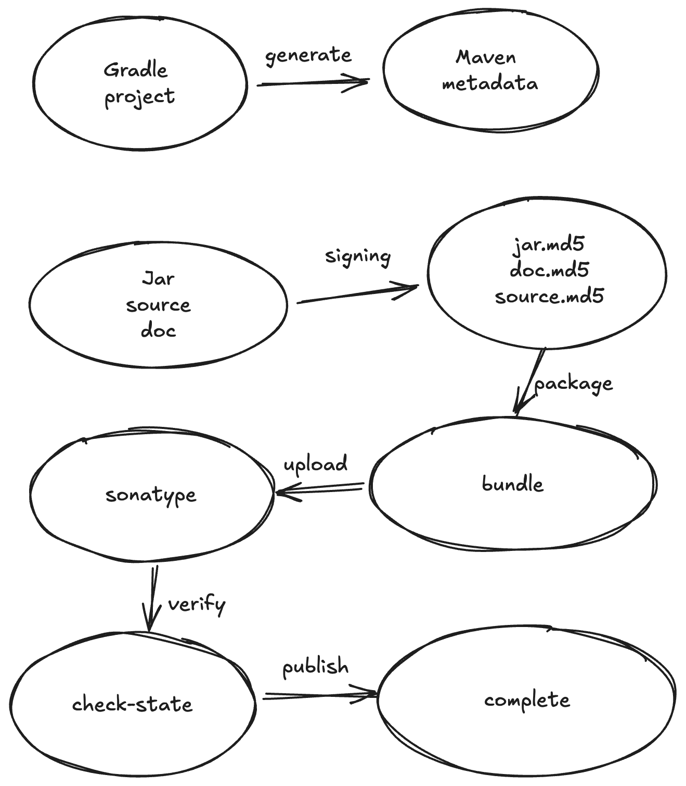

= Detail Document

Quick Start is a simple example, if you want to do more detailed configuration, you can refer to this document

== A complete flow chart

This document is based on the flowchart

== 1. Generate

The purpose of this step is to generate Metadata that conforms to the Maven standard.

Medivh-Publish Encapsulates the link:https://docs.gradle.org/current/userguide/publishing_maven.html[maven-publish] plugin of Gradle to achieve this function

If you have not import this plugin, Medivh-publisher will automatically help you import it, you do not need to do any configuration.

===  Relationship with Maven-Publish

If you have already used the Maven-Publish plugin configuration, Medivh-Publish will automatically use your configuration, you do not need to do any additional configuration.

> If you do not fill in the Maven-Publish plugin configuration completely, Medivh-Publish will help you fill in the default values, and will output a warning message on the console.

=== Configuration priority

Medivh-Publish > Maven-Publish > Default value

===  ``Maven-Publish`` Configuration

[source,kotlin]
----
publishing {
    publications {
        create<MavenPublication>("medivh-api") {
            groupId = project.group.toString()
            artifactId = project.name
            version = project.version.toString()
            from(components["java"])
            pom{
                name = "medivh-api"
                description = "medivh plugin api"
                url = "https://github.com/medivh-project/medivh"
                licenses{
                    license{
                        name = "GPL-3.0 license"
                        url = "https://www.gnu.org/licenses/gpl-3.0.txt"
                    }
                }
                developers {
                    developer {
                        id = "id"
                        name = "name"
                        email = "email"
                    }
                }
                scm {
                    connection = "scm:git:"
                    url = "https://github.com/medivh-project/medivh"
                }
            }
        }
    }
}
----

'''

===  ``Maven-Publish`` Configuration 

This is very similar to the Maven-Publish configuration

[source,kotlin]
----
medivhPublisher{
    groupId = project.group.toString()
    artifactId = project.name
    version = project.version.toString()
    pom{
        name = "medivh-api"
        description = "medivh plugin api"
        url = "https://github.com/medivh-project/medivh"
        licenses{
            license{
                name = "GPL-3.0 license"
                url = "https://www.gnu.org/licenses/gpl-3.0.txt"
            }
        }
        developers {
            developer {
                id = "id"
                name = "name"
                email = "email"
            }
        }
        scm {
            connection = "scm:git:"
            url = "https://github.com/medivh-project/medivh"
        }
    }
}
----

> Medivh-Publish guarantees that you will not make mistakes no matter how you configure it, because Medivh-Publish will help you fill in the default values, but it is still recommended that you check your configuration for omissions.

=== Configuration details

In Sonatype's link:https://central.sonatype.org/publish/requirements[Document]，the Pom Xml required to be pulished must contain the following configuration:

The configuration is populated granularly to each attribute configured.
For example:

The Scm information must contain `connection` and `url` attributes.
If you have configured `connection` but not `url`, Medivh-Publish will still help you fill in the other attribute.

> If you have manually configured these parameters, even if they are empty, Medivh-Publish will use your configuration and will not override the default values, unless null is set, because this is illegal in Maven.

|===
|Configuration |require |remark

|link:https://central.sonatype.org/publish/requirements/#supply-javadoc-and-sources[Source and Doc] |No | If don't upload,you can't download source and doc in your IDE
|link:https://central.sonatype.org/publish/requirements/#provide-files-checksums[Sign] | Yes| Use to verify the file, will be detailed later
|link:https://central.sonatype.org/publish/requirements/#correct-coordinates[correct coordinate] |Yes | artifact id like "com.example:my-library:1.0.0"
|link:https://central.sonatype.org/publish/requirements/#project-name-description-and-url[Project Info] |Yes | ``name``, ``description``,``url``
|link:https://central.sonatype.org/publish/requirements/#license-information[License] |Yes |
|link:https://central.sonatype.org/publish/requirements/#developer-information[Developer Info ] |Yes |
|link:https://central.sonatype.org/publish/requirements/#scm-information[SCM] |Yes | info about version control
|===

==== 1 Source and Doc

``Medivh-Publish`` upload source and doc by default, if you don't need it, you can configure it in build.gradle:

[source,kotlin]
----
medivhPublisher{
    withoutJavaDocJar()
    withoutSourcesJar()
}
----

Configuration is equivalent to:

[source,kotlin]
----
java {
    withJavadocJar()
    withSourcesJar()
}
----

==== 2 Singing

The purpose of this configuration is to get the signing file required by Maven

Medivh-Publish encapsulates the link:https://docs.gradle.org/current/userguide/signing_plugin.html#signing_plugin[signing] plugin of Gradle to achieve this function, generally no special configuration is required

> You need to make sure that you have configured the necessary information. link:./gpg_guide.adoc[Gpg Guide]

==== 3 correct coordinate

The purpose of this configuration is to get the correct coordinate required by Maven Like``com.example:my-library:1.0.0``

Default configuration value in Medivh-Publish:

``groupId = project.group``

``artifactId = project.name``

``version = project.version``

==== 4 Project Info 

Contains three attributes: ``name``, ``description``, ``url``

Medivh-Publish默认会把

`name = project.name`

`description = project.description`

Medivh-Publish will get your git remote url as the value of url, otherwise it will fill in an empty string

`url =  gitRemoteUrl or empty`

==== 5 License

The License default value is empty string

==== 6 Developer Info

Developer Info contains three attributes: `id`, `name`, `email`

Medivh-Publish will get the developer information of the git repository by default

name  `git config user.name`

email  `git config user.email`

id   `git config user.name`

==== 7 SCM信息

SCM contains `connection` and  `url`

Medivh-Publish will get your git remote url as the value of url, otherwise it will fill in an empty string

connection = `scm:git:remoteUrl`

url = `remoteUrl`

